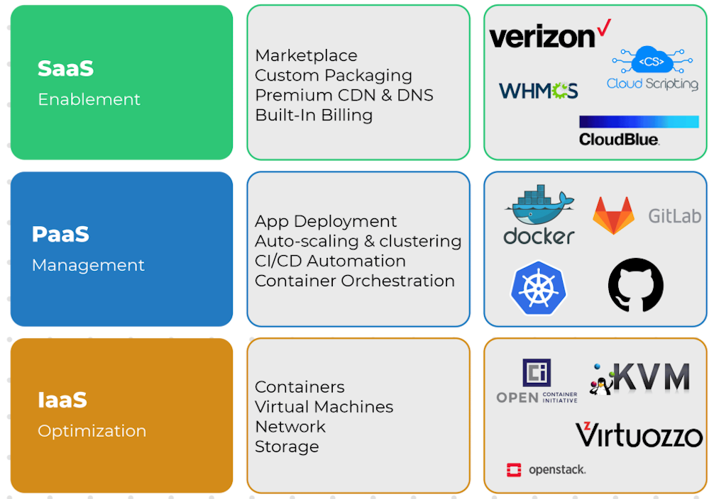
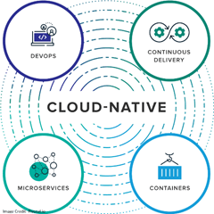

#### 什么是云计算：

云计算的历史最远可追溯到 1965 年，Christopher Strachey 发表了一篇论文，论文中正式提出了「虚拟化」的概念。而虚拟化正是云计算基础架构的核心，是云计算发展的基础。

在 2006 年 8 月 9 日，Google首席执行官埃里克·施密特（Eric Schmidt）在搜索引擎大会（SESSanJose2006）首次提出「云计算」（Cloud Computing）的概念。而亚马逊正是那年推出了 IaaS 服务平台 AWS。

但彼时的甲骨文掌门人 Larry Ellison 没少在社交软件上吐槽云：“这种白痴行为什么时候会停止？这不过是一时兴起的时尚潮流，是疯狂的事情。”而四年之后，这位“硅谷最老的花花公子”也不得不宣布向云战略进军了。

- 深圳IT领袖峰会
- 阿里云博士：王坚，坚持8年时间，2008年阿里云成立
- 全球三大云厂商：
  - 亚马逊AWS
  - 微软Azure
  - 阿里云，全国14地区建立200多个数据中心 

#### 云计算的类型

- 公有云：公有云是作为第三方云厂商所拥有和运营的，他们通过Internet提供计算资源，在公有云中，所		有的硬件、软件和其他一些基础性的结构均由云提供商拥有和运营。
- 私有云：私有云一般都是企业或者组织来使用的，可以位于企业数据中心之上，在私有云中，有专门的网络维护功能和基础结构。
- 混合云：即同时使用公有云和私有云。从而允许公司将敏感数据保留私有云中（安全性），同时使用公有云来运行应用程序（低成本）。

#### 云计算的服务模式

- IaaS（Infrastructure as a Service）：基础设施即服务
- PaaS（Platform as a Service ）：平台即服务
- SaaS（Software as a Service）：软件即服务

#### 虚拟化

- VMware虚拟机软件
- 企业级虚拟化：KVM虚拟化，在Linux系统管理虚拟机的

#### 常见服务器种类

- 塔式服务器
- 刀片服务器
- 机架式服务器

#### 云原生的生态系统

#### 

#### 常见技术

- Docker、Docker Compose:容器化技术 • Kubernetes:大规模容器编排
- Helm:云原生应用商店
- Rancher:易用的容器管理平台
- KubeSphere:一站式容器云平台
- OpenTracing:云原生链路追踪标准
-  Jaeger:云原生链路追踪实现产品
- Istio:ServiceMesh下的服务流量治理
- Jenkins、JenkinsX、Jenkins-BlueOcean:老牌的CI/CD平台 • Gitlab/hub-CICD:Gitlab/hub自带的CICD
- Argo:kubernetes声明式持续集成
- Nexus:Maven私库
- Habor:Docker私库
- Prometheus+Grafana:监控与可视化方案
- ElasticSearch+Fluentd+Kibana:日志与可视化方案 • Serverless:无服务器上云方案
- SpringCloud Kubernetes:微服务上云方案

#### 云原生的定义

- 云原生技术有利于各组织在公有云、私有云和混合云等新型动态环境中，构建和运行**可弹性扩展的应用。云原生的代表技术包括容器、服务网格、微服务、不可变基础设施和声明式API。**

- 这些技术能够构建容错性好、易于管理和便于观察的松耦合系统。结合可靠的**自动化手段**，云原生技术使工程师能够轻松地对系统作出频繁和可预测的重大变更。

- 云原生计算基金会（CNCF）致力于培育和维护一个厂商**中立的开源生态系统**，来推广云原生技术。我们通过将最前沿的模式民主化，让这些创新为大众所用。

> 官网定义：https://github.com/cncf/toc/blob/main/DEFINITION.md

#### CNCF 云原生交互景观

#### 云原生实战路径（Trail Map）

